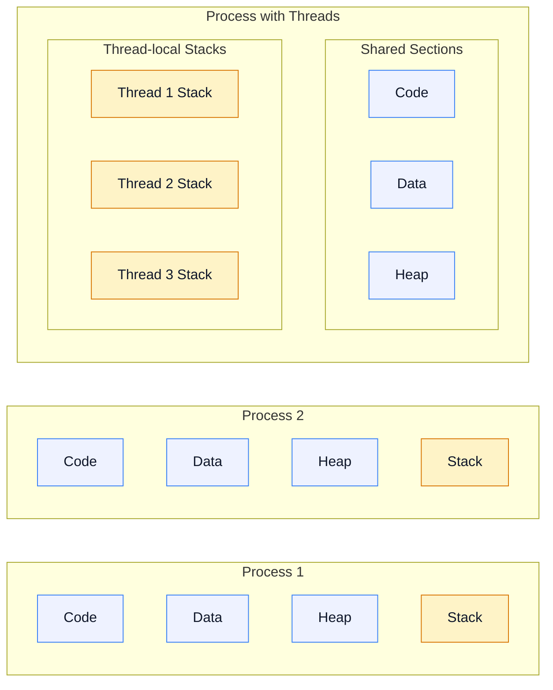
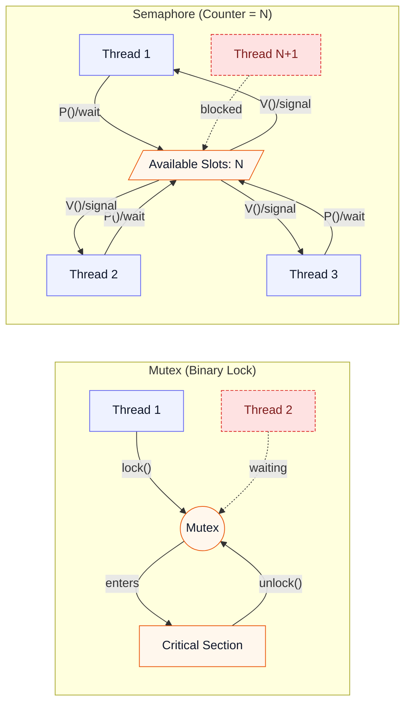

# OS: 프로세스 vs 스레드, 멀티 프로세스 vs 멀티 스레드, Thread-safe, 동기화 객체, 뮤텍스/세마포어

## 1. 프로세스 (Process) vs 스레드 (Thread)

### 프로세스
- **정의**: 실행 중인 프로그램의 인스턴스. 운영체제로부터 자원(메모리, CPU 시간 등)을 할당받아 독립적으로 실행되는 작업 단위.
- **특징**:
    - **독립성**: 각 프로세스는 독립적인 메모리 공간(Code, Data, Heap, Stack)을 가짐. 다른 프로세스의 메모리에 직접 접근할 수 없음.
    - **자원 할당**: 운영체제로부터 독립적인 자원을 할당받음.
    - **오버헤드**: 프로세스 간 전환(Context Switching) 시 많은 오버헤드가 발생.
    - **통신**: 프로세스 간 통신(IPC, Inter-Process Communication)은 복잡한 메커니즘(파이프, 소켓, 공유 메모리 등)을 통해 이루어짐.
    - **PCB (Process Control Block)**: OS가 프로세스를 관리하기 위해 유지하는 자료구조. 레지스터 스냅샷, 페이지 테이블 포인터, 열린 파일 목록, 스케줄링 우선순위 등을 포함하며 컨텍스트 스위칭 시 반드시 저장/복원된다.

### 스레드
- **정의**: 프로세스 내에서 실행되는 여러 흐름의 단위. 프로세스의 자원을 공유하며 실행되는 작업 단위.

 

#### 메모리 구조 다이어그램

- **특징**:
    - **공유**: 한 프로세스 내의 스레드들은 해당 프로세스의 메모리 공간(Code, Data, Heap)을 공유. 각 스레드는 자신만의 Stack 공간을 가짐.
    - **경량화**: 스레드 간 전환(Context Switching) 시 프로세스 전환보다 오버헤드가 적음.
    - **자원 공유의 용이성**: 프로세스 자원을 공유하므로 스레드 간 통신이 용이.
    - **동시성**: 여러 스레드가 동시에 실행되어 병렬성을 높일 수 있음.
    - **TCB (Thread Control Block)**: 스레드 ID, 스택 포인터, CPU 레지스터 상태, 스케줄링 정보 등을 담는 구조체로 PCB보다 훨씬 작아 스레드 전환 비용이 낮다.
    - **컨텍스트 스위칭 구성 요소**: 스레드 전환 시 주로 레지스터/프로그램 카운터/스택 포인터만 교체하면 되지만, 프로세스 전환은 추가로 주소공간 전환에 따른 페이지 테이블 변경, TLB flush, 캐시 지역성 손실까지 발생한다.
    - **사용자/커널 스레드 매핑**: 1:1(Native), M:1(Green thread), N:M(Lightweight Process) 모델이 있으며, 커널은 결국 LWP/커널 스레드를 스케줄링한다. N:M 모델에서는 사용자 수준 런타임이 자체 스케줄러를 두어 문맥 전환을 더 줄인다.

### 주요 차이점 요약
| 구분         | 프로세스                               | 스레드                                   |
| :----------- | :------------------------------------- | :--------------------------------------- |
| 자원 할당    | 독립적인 자원 할당 (OS로부터)          | 프로세스 자원 공유 (Code, Data, Heap)    |
| 메모리 공간  | 독립적 (Code, Data, Heap, Stack)       | 공유 (Code, Data, Heap), 독립적 (Stack)  |
| Context Switching | 높은 오버헤드                          | 낮은 오버헤드                           |
| 통신 방법    | IPC (복잡)                             | 프로세스 자원 공유 (용이)                |
| 독립성       | 높음                                   | 낮음 (프로세스에 종속)                   |

## 2. 멀티 프로세스 (Multi-process) vs 멀티 스레드 (Multi-thread)

### 멀티 프로세스
- **정의**: 여러 개의 독립적인 프로세스가 동시에 실행되는 방식.
- **장점**:
    - **안정성**: 각 프로세스가 독립적이므로 하나의 프로세스에 문제가 발생해도 다른 프로세스에 영향을 주지 않음.
    - **보안**: 독립적인 메모리 공간으로 인해 보안에 유리.
- **단점**:
    - **오버헤드**: 프로세스 생성 및 Context Switching 비용이 큼.
    - **자원 소모**: 각 프로세스가 독립적인 자원을 가지므로 많은 메모리 및 CPU 자원을 소모.
    - **통신 복잡성**: 프로세스 간 통신(IPC)이 복잡.
    - **NUMA/CPU Affinity 고려**: 프로세스별 주소 공간이 다르므로 NUMA 시스템에서는 프로세스를 노드/코어에 핀ning하여 메모리 지역성을 확보하는 전략을 사용.
- **적용 사례**: 웹 브라우저 (탭마다 별도의 프로세스), 여러 독립적인 애플리케이션 실행.

### 멀티 스레드
- **정의**: 하나의 프로세스 내에서 여러 개의 스레드가 동시에 실행되는 방식.
- **장점**:
    - **효율성**: 스레드 생성 및 Context Switching 비용이 적어 자원 효율성이 높음.
    - **자원 공유**: 프로세스의 자원을 공유하므로 스레드 간 통신이 용이.
    - **응답성**: 하나의 스레드가 블로킹되어도 다른 스레드가 작업을 계속할 수 있어 응답성이 좋음.
- **단점**:
    - **동기화 문제**: 여러 스레드가 공유 자원에 동시에 접근할 때 발생할 수 있는 동기화 문제(Race Condition 등)를 해결해야 함.
    - **안정성 취약**: 하나의 스레드에 문제가 발생하면 전체 프로세스에 영향을 줄 수 있음.
    - **오버서브스크립션**: 코어 수보다 많은 스레드를 만들면 문맥 전환 비용과 캐시 오염이 증가하므로, I/O 비중·CPU 바운드 비율 등을 고려해 스레드 수를 조절해야 함.
- **적용 사례**: 웹 서버 (요청마다 스레드 할당), GUI 애플리케이션, 게임.

### 동시성(Concurrency) vs 병렬성(Parallelism)
- **동시성**: 여러 작업이 번갈아가며 진행되는 구조를 의미. 단일 코어에서도 시간 분할로 구현 가능.
- **병렬성**: 실제로 여러 작업이 동시에 실행되는 상태. 코어 수 이상의 계산을 동시에 수행하려면 진짜 병렬 하드웨어가 필요.
- **설계 기준**: 병렬성이 필요한지(처리량 향상), 동시성만으로 충분한지(응답성) 구분하면 프로세스/스레드/비동기 I/O 조합을 더 명확히 결정할 수 있음.

### 혼합 아키텍처 패턴
- **프리포크 + 스레드 풀**: 웹 서버처럼 커널 리소스 보호가 필요한 경우, 프로세스로 격리한 뒤 각 프로세스 안에서 스레드 풀로 요청을 병렬 처리.
- **워크 프로세스 + 메시지 큐**: Node.js + worker process, Python Celery 등은 메인 프로세스가 이벤트 루프로 동시성을 확보하고, CPU 바운드 작업은 별도 프로세스/스레드 풀에 위임.
- **LWP 기반 N:M 모델**: Go 런타임은 많은 goroutine을 소수의 커널 스레드에 매핑해 컨텍스트 스위칭을 최소화한다. HotSpot JVM은 기본적으로 1:1 네이티브 스레드 모델을 사용하며, Project Loom의 가상 스레드처럼 사용자 스케줄링 계층을 추가해 N:M에 가까운 동작을 구현할 수 있다.

## 3. Thread-safe (스레드 안전)

- **정의**: 여러 스레드가 동시에 어떤 코드나 데이터를 사용하더라도 그 실행 결과가 항상 올바름을 보장하는 상태. 즉, 공유 자원에 대한 동시 접근으로 인해 발생할 수 있는 문제(Race Condition, Deadlock 등)가 없음을 의미.
- **Thread-safe를 보장하는 방법**:
    - **동기화 메커니즘 사용**: 뮤텍스, 세마포어, 락(Lock) 등을 사용하여 공유 자원에 대한 접근을 제어.
    - **불변 객체 (Immutable Object)**: 객체 생성 후 상태를 변경할 수 없도록 하여 여러 스레드가 동시에 접근해도 안전하게 사용.
    - **스레드 로컬 저장소 (Thread-Local Storage)**: 각 스레드가 자신만의 독립적인 데이터를 가질 수 있도록 하여 공유 자원 문제를 회피.
    - **원자적 연산 (Atomic Operation)**: 분리할 수 없는 최소 단위의 연산을 사용하여 중간에 다른 스레드가 끼어들 수 없도록 함.

### Thread-safe vs Reentrant vs Atomic
- **Thread-safe**: 여러 스레드가 동시에 호출해도 항상 올바른 결과. 내부적으로 락을 사용하건 불변 객체이건 상관없음.
- **재진입 가능(Reentrant)**: 함수가 실행 중일 때 다시 불려도(인터럽트/재귀) 안전. 락을 사용하면 thread-safe일 수 있으나 재진입성은 잃을 수 있다.
- **원자적(Atomic)**: CPU/메모리 모델 관점에서 쪼갤 수 없는 단일 연산. 모든 atomic 연산이 thread-safe를 담보하진 않지만, 공유 변수 업데이트를 위한 기초 블록으로 활용된다.

### 메모리 모델과 Happens-Before
- **Happens-Before 규칙**: 한 작업의 결과가 다른 작업에서 관측되려면 언어/런타임이 정의한 happens-before 관계에 들어야 한다. 락 획득-해제, 쓰레드 생성-조인 등이 대표적인 관계다.
- **언어별 메모리 모델**:
    - **Java Memory Model(JMM)**: `synchronized`, `volatile`, `final` 초기화 규칙 등을 정의.
    - **C++ Memory Order**: `std::atomic`에서 `memory_order_seq_cst/acq_rel/...`를 지정하여 가시성/재정렬 제약을 제어.
    - **Go**: goroutine과 채널, `sync/atomic`이 제공하는 happens-before 보장을 명시.

### 동시성 진행 보장 수준
- **Blocking (락 기반)**: 임계 구역 진입 실패 시 스레드가 잠들어 다른 스레드의 해제를 기다린다. 전통적 mutex/monitor가 여기에 해당하며, 스케줄러 정책에 따라 기아가 발생할 수 있다.
- **Lock-free**: 어떤 스레드가 중단되더라도 전체 시스템은 계속 전진한다. 개별 스레드는 무기한 지연될 수 있지만, 전체 처리량은 보장된다.
- **Wait-free**: 모든 스레드가 유한한 단계 내에 작업을 마친다. 강력한 대신 구현 난도가 높아 제한된 알고리즘에서만 사용된다.
- (필요 시) **Obstruction-free**: 충돌이 없다면 단일 스레드가 진행할 수 있음을 보장하지만, 명시적 재시도/백오프 전략을 요구한다.
- 언어/라이브러리 예시: Java `AtomicInteger`, C++ `std::atomic`, Go `sync/atomic.CompareAndSwap` 등은 lock-free/obstruction-free 구성 요소를 제공하며, 고급 라이브러리는 wait-free 큐나 링버퍼 같은 구조를 별도로 제공한다.

## 4. 동기화 객체 (Synchronization Objects)

- **정의**: 멀티 스레드 환경에서 공유 자원에 대한 여러 스레드의 동시 접근을 제어하여 데이터 일관성을 유지하고 Race Condition과 같은 문제를 방지하기 위한 메커니즘.
- **필요성**: 스레드들이 공유 자원에 동시에 접근하여 값을 변경할 때, 예상치 못한 결과가 발생할 수 있기 때문에 순서 제어가 필요.
- **주요 동기화 객체**:
    - **뮤텍스 (Mutex)**
    - **세마포어 (Semaphore)**
    - **락 (Lock)**
    - **모니터 (Monitor)**
    - **조건 변수 (Condition Variable)**

### 동기화 객체 선택 기준
- **임계 구역 길이**: 몇 사이클 이내라면 스핀락, 그 이상이면 뮤텍스/세마포어가 효율적. 리눅스의 adaptive mutex는 짧은 시간은 busy-wait, 이후에는 futex 대기 상태로 전환한다.
- **경쟁 강도**: 경합이 심하면 공정성 있는 queue-based lock(MCS, ticket lock)을 고려하고, 낮으면 일반 mutex가 낫다.
- **공정성/우선순위 역전**: 실시간 스케줄링에서는 priority-inheritance mutex를 사용해 높은 우선순위 스레드가 역전되지 않도록 한다.
- **자원 개수**: 단일 자원은 mutex, 여러 동시 허용 자원은 counting semaphore나 리미터 토큰 버킷으로 표현.
- **OS 지원**: Linux의 futex, Windows의 SRWLock처럼 커널이 제공하는 저비용 동기화 기본기를 우선 활용하고, 언어 런타임이 wrapping한 `synchronized`, `std::mutex`, `pthread_mutex_t` 등을 상황에 맞게 사용한다.
- **하이브리드 전략**: 스핀 후 슬립(backoff), 큐 스핀락 + mutex handoff 등으로 짧은 임계구역엔 CPU를 쓰고, 일정 시간 이후에는 커널 오브젝트로 넘어가 전체 효율을 높인다.

## 5. 뮤텍스 (Mutex) vs 세마포어 (Semaphore)

### 뮤텍스 (Mutex: Mutual Exclusion)
- **정의**: 상호 배제(Mutual Exclusion)를 의미. 공유 자원에 대한 접근을 한 번에 하나의 스레드만 허용하도록 하는 동기화 메커니즘.
- **특징**:
    - **소유 개념**: 뮤텍스를 획득한 스레드만이 뮤텍스를 해제할 수 있음.
    - **이진 세마포어**: 획득(lock)과 해제(unlock) 두 가지 상태만 가질 수 있어, 락을 걸거나 푸는 방식으로 동작.
    - **용도**: 임계 영역(Critical Section) 보호에 주로 사용.
- **동작 방식**:
    1. 스레드가 공유 자원에 접근하기 전에 뮤텍스를 획득(lock)하려 시도.
    2. 뮤텍스가 사용 중이 아니면 스레드는 뮤텍스를 획득하고 공유 자원에 접근.
    3. 뮤텍스가 사용 중이면 스레드는 뮤텍스가 해제될 때까지 대기.
    4. 공유 자원 사용을 마친 스레드는 뮤텍스를 해제(unlock).

### 세마포어 (Semaphore)
- **정의**: 공유 자원에 접근할 수 있는 스레드의 수를 제한하는 동기화 메커니즘. 카운터 변수를 통해 동시에 접근 가능한 자원의 개수를 관리.

 

#### 동작 방식 다이어그램

- **특징**:
    - **소유 개념 없음**: 세마포어를 획득한 스레드가 아니어도 세마포어를 해제할 수 있음 (일반적으로는 획득한 스레드가 해제).
    - **카운터**: 동시에 접근 가능한 자원의 개수를 나타내는 정수 값을 가짐.
    - **용도**: 여러 개의 공유 자원에 대한 접근 제어, 생산자-소비자 문제 해결 등.
- **동작 방식**:
    - `P()` 또는 `wait()` 연산: 세마포어 값을 1 감소. 값이 0보다 작아지면 스레드는 대기.
    - `V()` 또는 `signal()` 연산: 세마포어 값을 1 증가. 대기 중인 스레드가 있으면 하나를 깨움.
- **종류**:
    - **이진 세마포어 (Binary Semaphore)**: 0 또는 1의 값만 가질 수 있는 세마포어. 뮤텍스와 유사하게 동작하며, 주로 임계 영역 보호에 사용.
    - **계수 세마포어 (Counting Semaphore)**: 0 이상의 정수 값을 가질 수 있는 세마포어. 여러 개의 자원에 대한 접근을 제어할 때 사용.

### 뮤텍스 vs 세마포어 요약
| 구분         | 뮤텍스 (Mutex)                             | 세마포어 (Semaphore)                           |
| :----------- | :----------------------------------------- | :--------------------------------------------- |
| 목적         | 단일 공유 자원에 대한 상호 배제            | 여러 개의 공유 자원에 대한 접근 제어           |
| 소유         | 소유 개념 있음 (획득한 스레드만 해제)      | 소유 개념 없음 (어떤 스레드든 해제 가능)       |
| 값의 범위    | 0 또는 1 (이진 락)                         | 0 이상의 정수 (카운터)                         |
| 용도         | 임계 영역 보호                             | 자원 풀 관리, 생산자-소비자 문제               |
| 예시         | 화장실 칸 (한 번에 한 명만 사용)           | 주차장 (동시에 여러 대 주차 가능, 최대치 제한) |

## 6. 대표적인 동시성 문제

### 6.1 경쟁 상태 (Race Condition)
- **정의**: 둘 이상의 스레드가 같은 자원(데이터)에 동시에 접근하고 최소 하나가 쓰기 작업을 수행할 때, 실행 순서에 따라 결과가 달라지는 상황.
- **예시**: 공유 카운터를 `counter = counter + 1` 로 증가시키는 코드를 두 스레드가 동시에 실행하면, 중간 상태가 덮어써져 최종 값이 잘못될 수 있음.
- **해결**: 임계 구역(Critical Section)을 정의하고 락/뮤텍스, 원자 연산, 트랜잭션 메모리 등을 사용해 단일 스레드만 접근하도록 보장.

### 6.2 가시성·순서 문제
- CPU 캐시, 컴파일러 최적화 등으로 인해 한 스레드가 쓴 값이 다른 스레드에 늦게 보이거나 재배치될 수 있음.
- 메모리 배리어, `volatile`, 언어/런타임이 제공하는 happens-before 규칙을 따라야 올바르게 동작.

### 6.3 재진입성 (Reentrancy)
- 함수가 실행 중일 때 동일 함수가 다시 호출되더라도(인터럽트/다른 스레드) 안전하게 동작해야 reentrant.
- 전역 상태나 static 변수를 수정하지 않거나, 수정 시 철저한 락을 사용해야 함.

### 6.4 ABA 문제
- **상황**: Lock-free 알고리즘에서 CAS 비교 대상 값이 A→B→A로 바뀌면, 중간에 변경이 있었음에도 불구하고 같은 값이라 성공했다고 착각.
- **대응**: 버전 태그(Tagged Pointer), 더블-워드 CAS, hazard pointer로 참조 중인 노드를 보호.

### 6.5 False Sharing
- **정의**: 서로 다른 스레드가 독립적인 데이터를 수정하지만 같은 캐시 라인을 공유해 캐시 invalidation 폭탄이 발생하는 현상.
- **해결**: 구조체 패딩, `alignas` 등으로 캐시 라인 격리, 읽기 전용 데이터 분리.

### 6.6 Priority Inversion
- **정의**: 낮은 우선순위 스레드가 락을 쥐고 있고, 높은 우선순위 스레드가 이를 기다리는 동안 중간 우선순위 스레드가 CPU를 점유해 높은 스레드가 무한히 대기하는 문제.
- **대응**: Priority inheritance/ceiling, 우선순위 donation, RTOS에서는 bounded blocking proof 필수.

### 6.7 Producer-Consumer 버퍼 언더/오버런
- **문제**: 생산자는 버퍼가 가득 찼는데 계속 쓰고, 소비자는 비었는데 읽어 underrun/overrun이 발생.
- **도구**: Bounded buffer를 세마포어/조건 변수로 보호하고, 고수준 구조(BlockingQueue, channel)를 사용.

### 6.8 Heisenbug & 진단 도구
- **Heisenbug**: 디버그 출력을 넣거나 브레이크포인트를 걸면 사라지는 버그. 주로 타이밍에 민감한 동시성 버그에서 발생.
- **진단 도구**: Thread Sanitizer(TSAN), Valgrind Helgrind/DRD, Linux perf, eBPF uprobes/kprobes로 락 홀드 시간 추적, `perf lock`으로 경합 추세를 확인한다.

## 7. 교착 상태(Deadlock)와 관련 개념

### 7.1 교착 상태
- **정의**: 둘 이상의 스레드가 서로가 가진 자원을 기다리며 영원히 대기하는 상태.
- **필요 조건 (Coffman)**:
    1. 상호 배제(Mutual Exclusion)
    2. 점유 대기(Hold and Wait)
    3. 비선점(No Preemption)
    4. 순환 대기(Circular Wait)
- **예방/회피 기법**:
    - **락 순서 지정**: 모든 락에 순서를 부여하고 항상 같은 순서로 획득.
    - **타임아웃**: 일정 시간이 지나면 락을 포기하고 롤백.
    - **은행원 알고리즘** 같은 자원 할당 그래프 기반 회피.
    - **락 분할/락 정렬**로 긴 임계 구역을 줄여 교착 가능성을 낮춤.

### 7.2 기아(Starvation)와 라이브락(Livelock)
- **기아**: 우선순위가 낮거나 락 경쟁에서 계속 밀려 특정 스레드가 자원을 영원히 얻지 못하는 상태.
- **라이브락**: 스레드들이 서로 상태를 바꾸며 계속 양보하지만 실제 작업은 진행되지 않는 상태. 재시도(backoff) 전략으로 완화.

### 7.3 탐지 및 회복
- **자원 할당 그래프(RAG)/Wait-For Graph**: 노드 = 프로세스, 간선 = 자원 요청/할당. 순환이 발견되면 데드락 가능성이 존재.
- **Banker's Algorithm**: 시스템이 각 프로세스의 최대 수요/현재 할당을 알고 있을 때, 안전 순서를 찾을 수 있는지 검사해 자원 할당을 승인/거부.
- **OS 회복 전략**:
    - **선점(Preemption)**: 데드락에 연루된 자원을 강제로 떼어내 안전한 상태로 되돌림.
    - **롤백/프로세스 종료**: 체크포인트로 되돌리거나 희생 프로세스를 종료.
    - **타임아웃 기반 모니터링**: 일정 시간 이상 자원을 보유한 스레드를 감시해 경고/kill.

### 7.4 실무 디버깅 기법
- **락 덤프**: JVM thread dump, `pstack`, `gstack`, `kill -3` 등을 통해 현재 어떤 락을 쥐고/기다리는지 출력.
- **티켓 락 순서 검증**: queue-based lock은 티켓 번호를 확인해 순환 대기를 탐지. 로그에 락 획득 순서를 기록해 재현.
- **추적 도구**: `perf lock record`, eBPF 기반 락 추적, golang `runtime/pprof` 의 blocking profile 등으로 대기 시간을 시각화.
## 8. 추가 동기화 도구

- **조건 변수 (Condition Variable)**: 특정 조건이 충족될 때까지 스레드를 대기시키고 다른 스레드가 조건 충족 시 신호를 보냄. 뮤텍스와 함께 사용.
- **모니터 (Monitor)**: 락 + 조건 변수를 캡슐화한 언어/런타임 수준의 동기화 추상화 (`synchronized`, `@synchronized` 등).
- **리더-라이터 락 (Read-Write Lock)**: 읽기 작업은 동시에 허용하고 쓰기 작업은 단독으로 수행. 읽기 위주의 워크로드에 유리.
- **스핀락 (Spinlock)**: 락을 얻을 때까지 CPU를 양보하지 않고 반복 확인. 락 보유 시간이 매우 짧고 컨텍스트 스위치 비용을 줄이고 싶을 때 사용.
- **배리어/CountDownLatch**: N개의 스레드가 모두 특정 지점에 도달할 때까지 대기하게 만들어 다음 단계로 함께 진행.
- **이벤트/퓨처(Future, Promise)**: 비동기 작업의 완료 시점을 표현하고 다른 스레드가 결과를 기다리게 하는 고수준 동기화 도구.

## 9. Thread-safe 설계 전략

- **상태 분리**: 공유 상태를 최소화하고 가능한 한 스레드별 사본을 유지 (Thread-Local Storage, 메시지 패싱).
- **불변 객체 활용**: 생성 후 상태가 변하지 않는 데이터 구조를 사용하면 잠금 없이도 안전하게 공유할 수 있음.
- **락 범위 최소화**: 임계 구역을 짧게 유지하고, 필요 시 더 작게 쪼갠 파인 그레인드 락이나 읽기/쓰기 락을 고려.
- **락 프리/원자 연산**: CAS(Compare-And-Swap)와 같은 원자 연산과 lock-free 자료구조로 대기 시간을 줄임.
- **우선순위 역전 대응**: 실시간 시스템에서는 우선순위 상속/천이 같은 정책을 사용하여 낮은 우선순위 스레드가 높은 우선순위를 블로킹하지 않도록 함.
- **테스트/분석 도구**: Thread Sanitizer, Helgrind 같은 동시성 버그 탐지 도구로 레이스나 교착을 조기에 발견.
